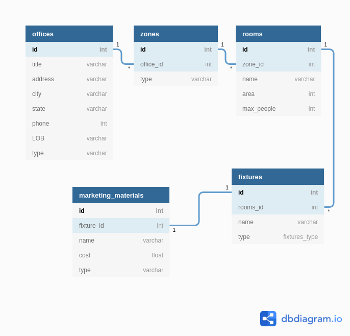

# Generate reports

The program help management to get reporting about marketing materials consumption in offices all around the world.

The project is designed for quick and easy generation of reports, which helps to assess which marketing material is most popular.

---

## How to use

### Installation
The project is written in `Ruby` language.
For ease of use was created `Gemfile` where are all gems stored.

In order to start the project, you need to run a several of commands:

* To install all the required dependencies
```
bundler install
```

* To create the required tables in the database created a script `create_structure.rb`

```
ruby script_create_structure.rb
```
* To start, you need to go to the folder with the application `./App` and execute the last command


```zsh
cd ./App
rackup

# or this
rackup ./App/config.ru
```

### Deinstallation


---

## Documentation

```
mobidev-generate-reports/
 ├── App/
 │    ├── config.ru
 │    ├── controllers/
 │    │    ├── fixture_report.rb
 │    │    ├── marketing_cost_report.rb
 │    │    ├── modules/
 │    │    │   └── insert_module.rb
 │    │    ├── office_installation_report.rb
 │    │    ├── root.rb
 │    │    ├── search_office.rb
 │    │    ├── state_report.rb
 │    │    └── upload_data.rb
 │    ├── public/
 │    │    └── css/
 │    │        ├── installation.css
 │    │        ├── search.css
 │    │        ├── styles.css
 │    │        └── upload.css
 │    └── templates/
 │        ├── fixture_report.erb
 │        ├── fixture_report_by_office.erb
 │        ├── materials_report.erb
 │        ├── office_installation.erb
 │        ├── root.erb
 │        ├── search_offices_reports.erb
 │        ├── states_report.erb
 │        └── upload.erb
 ├── Gemfile
 ├── env.rb
 ├── script_create_structure.rb
 └── script_drop_tables.rb
```

### Database

