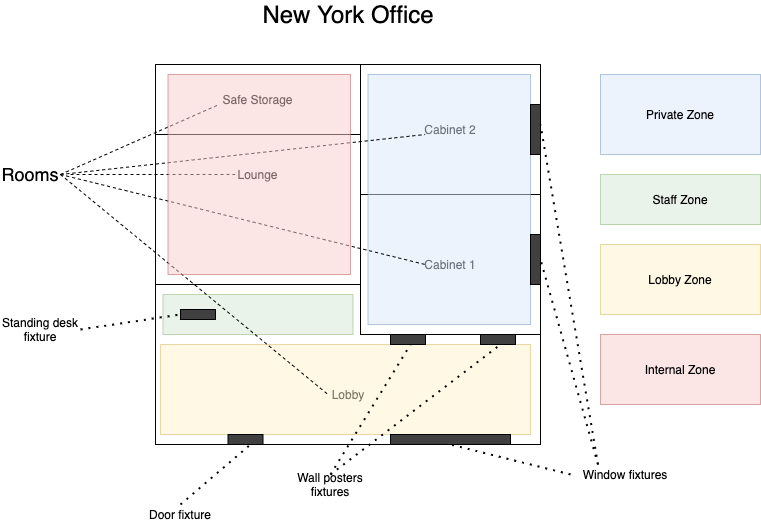

# Generate reports

The program help management to get reporting about marketing materials consumption in offices all around the world.

The project is designed for quick and easy generation of reports, which helps to assess which marketing material is most popular.

---

## How to use

### Installation
The project is written in `Ruby` language.
For ease of use was created `Gemfile` where are all gems stored.

In order to start the project, you need to run a several of commands:

To install all the required dependencies
```
bundle install --without dev
```

To create the required tables in the database created a script `create_structure.rb`

_Before that, make sure that you have created a base fpr the project, enter its data into `env.rb`_
```
ruby script_create_structure.rb
```
If everything is dote correctly, you will see the message: `Succeeded connection to database` and messages about creating tables

* To start, you need execute the last command

```zsh
cd ./App
rackup

# or this
rackup ./App/config.ru
```

### Deinstallation

To uninstall run the commands.

_Before deleting the database, make sure that there is no important data there or make backup. Script **delete schema** of this database_

```shell
ruby script_drop_tables.rb

cd ..
rm -rf mobidev-generate-reports
```

---

## Documentation
Project has the following structure. 

If you want to change this structure, make sure you change all dependencies

```
mobidev-generate-reports/
 ├── App/
 │    ├── config.ru
 │    ├── controllers/
 │    │    ├── modules/
 │    │    │   └── insert_module.rb
 │    │    ├── fixture_report.rb
 │    │    ├── marketing_cost_report.rb
 │    │    ├── office_installation_report.rb
 │    │    ├── root.rb
 │    │    ├── search_office.rb
 │    │    ├── state_report.rb
 │    │    └── upload_data.rb
 │    ├── public/
 │    │    └── css/
 │    │        ├── installation.css
 │    │        ├── search.css
 │    │        ├── styles.css
 │    │        └── upload.css
 │    └── templates/
 │        ├── fixture_report.erb
 │        ├── fixture_report_by_office.erb
 │        ├── materials_report.erb
 │        ├── office_installation.erb
 │        ├── root.erb
 │        ├── search_offices_reports.erb
 │        ├── states_report.erb
 │        └── upload.erb
 ├── Gemfile
 ├── env.rb
 ├── script_create_structure.rb
 └── script_drop_tables.rb
```

### Database
This database was developed, according to the term of reference and according to the given data. Report will be generated based on this data.

* This is a drawing according to which it was necessary to compose a database for storing data without duplicates and quickly searching through them.



Upon close examination of this drawing, such connections between the data were revealed.

```sh
"offices" 1-* "zones"
"zones" 1-* "rooms"
"rooms" 1-* "fixtures"
"fixtures" 1-1 "marketing_materials"
```

Further, according to these links, a base diagram was created, with fields that correspond to the incoming data.


### Upload data